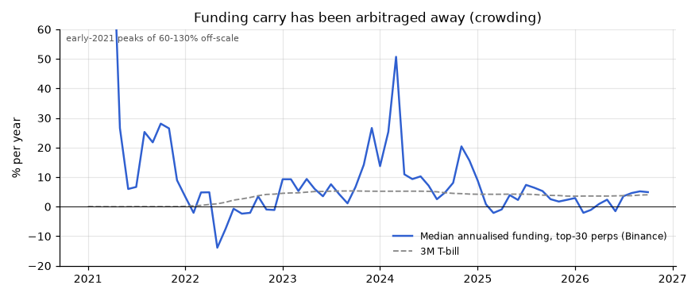
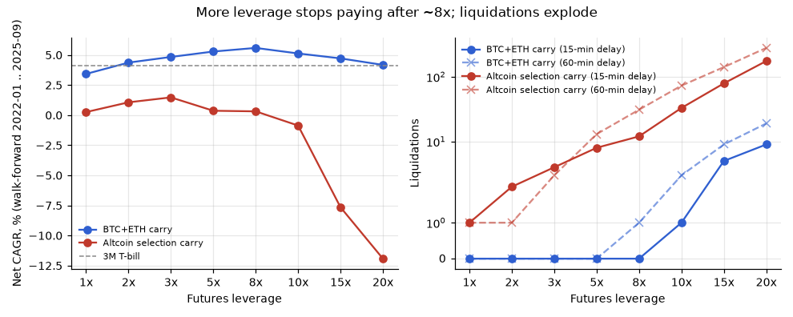
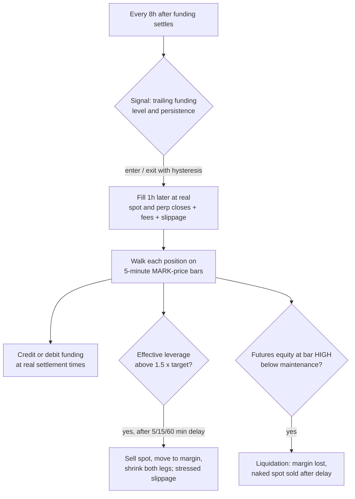

# Crypto Funding-Rate Carry Research

Research on **leveraged cash-and-carry**: long spot plus an equal-size short USDⓈ-M perpetual,
collecting funding while staying price-neutral. The project includes a 5-minute, mark-price
**liquidation simulator** with a delayed margin-risk rule, a leverage sweep from 1× to 20×
(fixed and volatility-dynamic), walk-forward parameter selection, a one-shot holdout,
cross-exchange funding data (Binance / Bybit / OKX) and a daily funding-regime monitor.

> **Disclaimer.** This is a research project. It is **not investment advice** and it has
> **never been used with real money**. It places no orders and uses no exchange API keys.
> The conclusion is negative: in the most recent year the trade earned **less than holding a
> stablecoin in T-bills**.



## Key findings
1. **The trade has been crowded out.** The median annualised funding of the top-30 perps fell from about 41% (2021) and 15% (2024) to **3% (2025) and 2% (2026)**. By 2026, 38% of daily prints are negative. The same compression shows up on Bybit and OKX (see table below).
2. **Leverage helps less than people expect.** With leverage *L*, notional = capital × L/(L+1). Going from 1× (50% of capital deployed) to 20× (95%) can at most **double** the carry, while the distance to liquidation shrinks from ~99% to ~4.5%. In the data, net return peaks at **~8×**. Above that, liquidations and forced-rebalance costs make it worse.
3. **Chasing high-funding altcoins loses money.** Selecting coins by funding level and persistence (48 parameter sets, walk-forward) earned 0-1.5% per year with drawdowns of 5-11%. At 10× and above it lost money. Costs consumed 38-155% of the funding collected, and sudden short squeezes caused liquidations even at 1×.
4. **Plain BTC+ETH carry works but barely beats cash.** Walk-forward 2022-01 to 2025-09: 5.3% CAGR at 5× versus 4.1% for 3-month T-bills. Final holdout 2025-10 to 2026-09: **+1.6% versus +3.75% for T-bills** and +3.2% for Aave USDT. **It failed the test.**
5. **The risk rule is essential.** Without the margin top-up rule, even the 1× BTC+ETH book is liquidated three times, because BTC doubling in 2023-24 erodes the short's margin.

### Lessons learned
- **Delisting artefact (ALPACA).** A first run showed an unexplained one-step equity jump of +5,489 USDT (55% of starting capital). ALPACA's spot market was delisted while the perp kept trading, and the spot leg had been valued off the perp mark price. The fix: spot is priced from the last completed hour's real spot/perp ratio, clipped to ±5% so data glitches cannot create fake profits. If spot prints stop for more than 3 hours, the position is force-closed and the spot leg is sold at 90% of its last price. Entries are skipped when spot and perp diverge by more than 5%.
- **A 1-hour look-ahead in the basis.** The spot/perp ratio was first read from the bar that closes *after* the event time. It now uses the last completed bar.
- **Rate limits are a real operational risk.** A bulk REST download triggered Binance's automatic IP ban (HTTP 418) for about 25 minutes. Since then, research downloads use only the static archive, live REST calls go through a per-endpoint throttle, and any 418/429 response pauses all threads until the `retry-after` time has passed.
- **Research hygiene.** The BTC+ETH baseline was added *after* the altcoin walk-forward results were known. It has no tuned parameters, and the README says so openly. A mechanical rule picked a dynamic ~7× leverage; I recommended 5× instead (+0.14 pp CAGR does not justify cutting the liquidation buffer from 19% to 14%). Both choices were committed to git before the holdout ran.

## Results by leverage
Walk-forward period: 2022-01 to 2025-09. The risk rule fires with a 15-minute delay; the delay-stress columns use other delays.

| Leverage | Liq. distance (BTC) | BTC+ETH CAGR | Max DD | Liquidations (15 / 60 min / no rule) | Holdout 12 m | Alt-selection CAGR | Alt liquidations |
|---|---|---|---|---|---|---|---|
| 1× | 99% | 3.4% | −0.4% | 0 / 0 / 3 | 1.1% | 0.3% | 1 |
| 2× | 49% | 4.4% | −0.5% | 0 / 0 / 8 | 1.3% | 1.1% | 2 |
| 3× | 33% | 4.8% | −0.6% | 0 / 0 / 12 | 1.4% | 1.5% | 4 |
| **5×** | **19%** | **5.3%** | −0.6% | 0 / 0 / 19 | **1.6%** | 0.4% | 8 |
| 8× | 12% | **5.6%** | −0.7% | 0 / 1 / 33 | 1.7% | 0.3% | 12 |
| 10× | 9% | 5.1% | −2.1% | 1 / 3 / 42 | 1.7% | −0.9% | 33 |
| 15× | 6% | 4.7% | −2.5% | 5 / 9 / 65 | 1.8% | −7.7% | 79 |
| 20× | 4.5% | 4.2% | −2.4% | 9 / 19 / 89 | 1.8% | −11.9% | 175 |

Benchmarks for the walk-forward period: 3-month T-bill 4.1% CAGR, BTC buy & hold 27.2% CAGR with a −67% drawdown. The holdout year was a bear market without upside squeezes, so the higher-leverage rows looked safe there. **That is not evidence that high leverage is safe.** Full tables, including worst month, negative-funding frequency and the cost/funding ratio, are in `reports/leverage_table.csv`, `reports/majors.json` and `reports/research.json`.



Median annualised funding across coins, by exchange:

| Year | Binance | Bybit | OKX |
|---|---|---|---|
| 2021 | 37.5% | 36.5% | 28.4% |
| 2022 | −0.5% | 1.9% | −3.3% |
| 2023 | 7.3% | 9.6% | 6.0% |
| 2024 | 13.0% | 14.2% | 12.2% |
| 2025 | 3.0% | 4.5% | 3.9% |
| 2026 YTD | 1.7% | 2.6% | n/a |

## How the simulator works



- **Costs:** Binance VIP0 fees, with spot and futures charged separately (taker 0.10% / 0.05%; a maker scenario uses 0.075% / 0.02%). Spread and slippage depend on liquidity and are tripled for forced trades. Basis P&L comes from real spot vs perp fills.
- **Liquidation:** maintenance margin is 0.5% for BTC/ETH and 1.25% for other coins. Isolated margin.
- **Universe:** monthly top-30 perps by trailing futures volume that also have a spot pair. Delisted contracts are included.
- **Not modelled:** exchange insolvency (FTX-style), auto-deleveraging, portfolio/cross margin, and contracts with a 1000× multiplier (e.g. `1000PEPE`), which are excluded.

## Funding-regime monitor
`scripts/monitor.py` runs once a day as a systemd timer and makes about 32 rate-limited public API calls. It logs the median annualised funding of the top-30 perps. If that median stays above 10% for 14 consecutive days, it writes `ALARM.txt` and sends a content-free push via ntfy.sh (topic set in `.env`). The paper trader in `src/farb/paper.py` is written and dry-run tested, but it was **not deployed** because the strategy failed its holdout.

## Run it

```bash
git clone <this repo> && cd crypto-funding-carry-research
python -m venv .venv && source .venv/bin/activate
pip install -r requirements.txt && pip install -e .
export FA_HOME=$PWD
python -m pytest -q tests

FA_NO_REST=1 python scripts/download.py   # archive-only (no rate limits), ~4 GB, ~1 h
python scripts/research.py                # 480 sims + delay stress (~25 min, 10 cores, ~12 GB RAM)
python scripts/research_majors.py         # BTC+ETH leverage sweep
python scripts/exchanges.py               # Binance vs Bybit vs OKX
python scripts/make_figures.py
```

The holdout is guarded by `reports/HOLDOUT_USED.lock`.

**Data sources:** [Binance public data](https://data.binance.vision), Bybit v5 public API, the OKX historical funding archive, [DefiLlama](https://defillama.com) (Aave USDT yield) and [FRED DTB3](https://fred.stlouisfed.org/series/DTB3) (T-bill). No API keys are needed. The data is not included in this repo.

## License
MIT. See [LICENSE](LICENSE).
